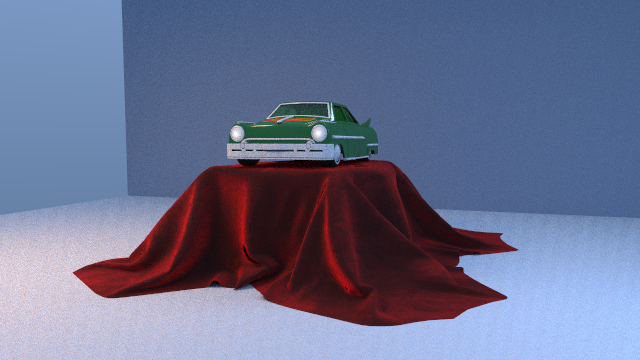

# Computer Graphics Lab

[](https://github.com/jackson09255921/Computer_Graphics/actions/workflows/ci.yml)

一個從 2022 OpenGL 課程作業逐步擴建而成的電腦圖學實驗室。原始作業完整保留在
`legacy/`；現代化功能集中於 `LabX/`，涵蓋 CPU ray tracing、Monte Carlo path
tracing、CUDA、OptiX、glTF PBR、HDR importance sampling、動畫與可重現的視覺驗證。

The project implements rendering algorithms directly rather than delegating them
to a graphics API. OpenGL/GLUT remains a presentation layer for the legacy labs;
the reusable core and offline renderers are API-independent and headless.



## Current capabilities

### Geometry and classic rendering

- Polygon filling, viewport transforms, 2D/3D clipping, back-face culling and Z-buffering.
- Model/view/projection transforms and perspective division.
- Flat, Gouraud and Phong shading in the preserved OpenGL labs.
- OBJ, legacy ASC and glTF triangle meshes.
- Arbitrary-degree Bézier evaluation, derivatives, splitting and De Casteljau sampling.
- Keyframe translation/scale, quaternion SLERP and cubic Bézier easing.

### CPU ray and path tracing

- Sphere and triangle intersections with a median-split BVH.
- Point and rectangular area lights, hard/soft shadows and recursive reflections.
- Deterministic progressive tiled rendering with reproducible random seeds.
- Lambert and metallic/roughness GGX BRDFs.
- Rough dielectric reflection/transmission, Snell refraction, Fresnel and total internal reflection.
- Next-event estimation and Veach-style multiple importance sampling.
- RGBE HDR environment maps with latitude-longitude importance sampling.

### CUDA path tracing

- CPU-built flattened BVH traversed on the GPU.
- Bounded 16×16 tile buffers for the RTX 4060 Laptop 8 GiB target.
- Multi-light MIS, environment MIS, Russian roulette and up to six path bounces.
- Emissive triangle mesh lights with area/power CDF selection, next-event
  estimation, solid-angle PDFs and BSDF/light power-heuristic MIS.
- Textured glTF scenes, multi-object composition and deterministic quality renders.
- Base-color, normal, metallic-roughness, emissive and occlusion maps.
- `KHR_materials_transmission`, `KHR_materials_ior`, `KHR_materials_clearcoat` and
  `KHR_materials_sheen`.
- Energy-compensated clearcoat and Charlie/Neubelt fabric sheen.
- Clearcoat factor (R), roughness (G), and independent normal textures with
  per-slot UV transforms and normal scale.
- Sheen color (sRGB RGB) and roughness (linear alpha) textures with independent
  UV mappings.
- Red-channel transmission textures layered over dielectric Fresnel/refraction.
- `KHR_materials_specular` factor/color controls and alpha/RGB textures with
  distinct F0 and grazing-angle F90 behavior.
- `KHR_materials_anisotropy` strength, rotation and RGB direction/strength map
  with matched anisotropic GGX sampling and PDF.
- RGBA textures with `OPAQUE`, cutoff `MASK` and stochastic `BLEND` traversal.
- Correct glTF `doubleSided` handling and single-sided back-face culling.
- External glTF image URIs, repeat/clamp/mirrored-repeat samplers and
  `KHR_texture_transform` with independent UV set, offset, rotation and scale
  for each supported texture slot.

### OptiX research branch

- Indexed triangle GAS, SBT records, RTX radiance and shadow rays.
- Recursive GGX reflections and progressive GPU accumulation.
- Normal, depth, albedo, motion, validity and reservoir diagnostic buffers.
- Moving-camera and animated-geometry reprojection with history rejection.
- Temporal and spatial ReSTIR DI reservoir reuse plus a four-light RTX reference.

OptiX is optional and is most reliable on native Windows. CPU and ordinary CUDA
development use WSL2.

## Visual evolution

Reviewed images are immutable experiment records. Every stage changes one main
variable while preserving model, resolution, sample count and seed where
possible.

| Stage | Technique | Reviewed output |
| --- | --- | --- |
| ToyCar 3 | Three-quarter camera | [image](LabX/images/evolution/evolution_toycar_stage3_three_quarter_camera_128spp.png) |
| ToyCar 4 | Three-light studio and multi-light MIS | [image](LabX/images/evolution/evolution_toycar_stage4_studio_lighting_128spp.png) |
| ToyCar 5 | Clearcoat | [image](LabX/images/evolution/evolution_toycar_stage5_clearcoat_128spp.png) |
| ToyCar 6 | Fabric sheen | [baseline](LabX/images/evolution/evolution_toycar_stage6_fabric_baseline_128spp.png) / [sheen](LabX/images/evolution/evolution_toycar_stage6_fabric_sheen_128spp.png) |
| ToyCar 7 | Close material framing | [baseline](LabX/images/evolution/evolution_toycar_stage7_close_baseline_128spp.png) / [sheen](LabX/images/evolution/evolution_toycar_stage7_close_sheen_128spp.png) |
| Helmet 8 | Occlusion map | [baseline](LabX/images/evolution/evolution_helmet_stage8_baseline_128spp.png) / [occlusion](LabX/images/evolution/evolution_helmet_stage8_occlusion_128spp.png) |
| Alpha 9 | MASK and BLEND | [opaque](LabX/images/evolution/evolution_alpha_stage9_opaque_128spp.png) / [alpha](LabX/images/evolution/evolution_alpha_stage9_alpha_128spp.png) |
| Texture 10 | KHR texture transforms | [baseline](LabX/images/evolution/evolution_texture_stage10_baseline_128spp.png) / [transformed](LabX/images/evolution/evolution_texture_stage10_transformed_128spp.png) |
| Clearcoat 11 | Factor, roughness and coat-normal textures | [baseline](LabX/images/evolution/evolution_clearcoat_stage11_baseline_128spp.png) / [textures](LabX/images/evolution/evolution_clearcoat_stage11_textures_128spp.png) |
| Sheen 12 | Color and alpha-channel roughness textures | [baseline](LabX/images/evolution/evolution_sheen_stage12_baseline_128spp.png) / [textures](LabX/images/evolution/evolution_sheen_stage12_textures_128spp.png) |
| Transmission 13 | Per-pixel dielectric transmission | [baseline](LabX/images/evolution/evolution_transmission_stage13_baseline_128spp.png) / [textures](LabX/images/evolution/evolution_transmission_stage13_textures_128spp.png) |
| Specular 14 | Dielectric F0/F90 factor and color controls | [baseline](LabX/images/evolution/evolution_specular_stage14_baseline_128spp.png) / [extension](LabX/images/evolution/evolution_specular_stage14_extension_128spp.png) |
| Anisotropy 15 | Directional GGX strength, rotation and texture | [baseline](LabX/images/evolution/evolution_anisotropy_stage15_baseline_128spp.png) / [extension](LabX/images/evolution/evolution_anisotropy_stage15_extension_128spp.png) |
| Mesh light 16 | Emissive triangles, NEE and BSDF/light MIS | [baseline](LabX/images/evolution/evolution_mesh_light_stage16_baseline_128spp.png) / [NEE + MIS](LabX/images/evolution/evolution_mesh_light_stage16_nee_mis_128spp.png) |

See the complete [rendering evolution log](LabX/images/EVOLUTION.md) and
[reviewed image gallery](LabX/images/README.md).

## Repository layout

```text
.
├── LabX/
│   ├── assets/          # glTF/GLB and legacy ASC loaders
│   ├── curves/          # Bézier experiments
│   ├── environment/     # RGBE HDR loading and importance sampling
│   ├── gpu/cuda/        # CUDA path tracer and ReSTIR foundations
│   ├── gpu/optix/       # native OptiX renderer and temporal/spatial reuse
│   ├── images/          # reviewed pipeline, quality and evolution PNGs
│   ├── pbr/             # BRDF/Fresnel helpers and tests
│   ├── progressive/     # deterministic tile scheduler
│   ├── sampling/        # PDFs and MIS
│   └── raytracing/      # CPU ray/path tracer demos
├── legacy/              # preserved 2022 OpenGL coursework
├── src/                 # reusable API-independent C++ core
├── tests/               # unit and visual-regression references
├── tools/               # asset conversion and validation pipelines
├── docs/                # architecture and technology timeline
├── environment.yml      # WSL2 Conda/CUDA environment
└── Jenkinsfile          # CPU, optional GPU and quality-render pipeline
```

## WSL2 development environment

The primary development environment is Ubuntu 24.04 on WSL2 with the Conda
environment defined by `environment.yml`. The Windows NVIDIA driver is shared
with WSL; do not install a separate Linux display driver.

```bash
conda env create -f environment.yml
conda activate computer-graphics

cmake -S . -B build-wsl-gpu -G Ninja \
  -DBUILD_LEGACY_LABS=OFF \
  -DBUILD_CUDA_DEMOS=ON \
  -DCG_CUDA_ARCHITECTURES=89 \
  -DCMAKE_BUILD_TYPE=Release
cmake --build build-wsl-gpu --parallel
ctest --test-dir build-wsl-gpu --output-on-failure
```

The current WSL OptiX SDK can compile, but the runtime library may not be
available. In that case, validate the normal CUDA suite with:

```bash
ctest --test-dir build-wsl-gpu --output-on-failure -E '^optix_'
```

## Portable CPU build

```bash
cmake -S . -B build-core -DBUILD_LEGACY_LABS=OFF -DCMAKE_BUILD_TYPE=Release
cmake --build build-core --parallel
ctest --test-dir build-core --output-on-failure
```

Useful demos:

```bash
./build-core/bezier_demo bezier.ppm
./build-core/raytracer_demo raytracer.bmp
./build-core/pathtracer_demo pathtracer.bmp 128
./build-core/gltf_demo model.glb
./build-core/animation_demo animation_frames
```

## CUDA renderer examples

```bash
./build-wsl-gpu/cuda_pathtracer --self-test
./build-wsl-gpu/cuda_pathtracer --gltf model.glb output.ppm 64
./build-wsl-gpu/cuda_pathtracer --hdr environment.hdr output.ppm 128
./build-wsl-gpu/cuda_pathtracer --scene output.ppm 128 model1.glb model2.glb

# Controlled visual comparisons
./build-wsl-gpu/cuda_pathtracer --fabric-close-sheen ToyCar.glb toycar.ppm 128
./build-wsl-gpu/cuda_pathtracer --occlusion DamagedHelmet.glb helmet.ppm 128
./build-wsl-gpu/cuda_pathtracer --alpha AlphaBlendModeTest.glb alpha.ppm 128
```

## Validation and Jenkins

The ordinary suite currently contains 22 portable CPU tests. A CUDA-enabled
build adds four GPU-related tests for a total of 26 non-OptiX tests. Tests cover
math/core drawing, curves, ray tracing, PBR, progressive rendering, MIS,
animation, HDR environments, glTF/GLB, legacy ASC, converted assets, visual
regressions, CUDA capability, the CUDA path tracer and ReSTIR invariants.

```bash
python tools/run_validation_pipeline.py \
  --build-dir build-jenkins \
  --gpu-build-dir build-wsl-gpu

python tools/run_quality_renders.py \
  --cpu-build-dir build-jenkins \
  --gpu-build-dir build-wsl-gpu
```

The validation pipeline:

- runs CTest;
- validates manifest-pinned Khronos assets and license READMEs;
- renders Bézier, CPU ray/path tracing, animation and legacy meshes;
- optionally runs CUDA smoke and multi-object renders;
- rejects missing, truncated, blank or incorrectly sized images;
- publishes PNGs under `LabX/images`;
- writes JSON and JUnit reports for Jenkins.

Jenkins parameters `RUN_GPU_TESTS` and `RUN_QUALITY_RENDERS` enable the optional
CUDA and slower 512 spp CPU / 128 spp GPU stages.

## Native Windows OptiX

After downloading the NVIDIA OptiX SDK:

```powershell
$env:OPTIX_ROOT = 'D:\github\.deps\optix-sdk-9.1.0'
cmake -S . -B build-optix-windows `
  -DBUILD_LEGACY_LABS=OFF `
  -DBUILD_CUDA_DEMOS=OFF `
  -DBUILD_OPTIX_DEMOS=ON
cmake --build build-optix-windows --config Release --parallel
ctest --test-dir build-optix-windows -C Release -R optix_ --output-on-failure
```

## Legacy coursework

The original OpenGL labs remain buildable with `BUILD_LEGACY_LABS=ON` and are
documented separately from the modern renderer. They cover interactive drawing,
polygon filling, transforms, clipping, Z-buffering and Flat/Gouraud/Phong
shading. See [the legacy source tree](legacy/) and
[architecture overview](docs/architecture.md).

## Current roadmap and limitations

The renderer is already useful for deterministic PBR experiments, but full glTF
and production rendering compatibility is not claimed. Emissive triangles now
participate in direct-light transport through NEE/MIS. The next stages are:

1. Colored volume absorption and more stable transmission sampling.
2. Focused glass-caustic validation and variance measurements.
3. Adaptive sampling and denoising after stable temporal-buffer validation.

Sparse accessors, Draco/Meshopt compression, skinning and morph targets also
remain future asset-pipeline work.

## Acknowledgements and asset provenance

This repository began as 2022 computer graphics coursework and was informed by
the [GAMES101 course](https://sites.cs.ucsb.edu/~lingqi/teaching/games101.html).
External glTF validation models come from the Khronos glTF Sample Assets
repository; each downloaded model keeps its upstream README and license, while
`LabX/data/external/gltf_samples/manifest.json` records its source, byte size and
SHA-256 digest. Legacy meshes remain separated because some still require a
provenance review before a repository-wide open-source license can be selected.
