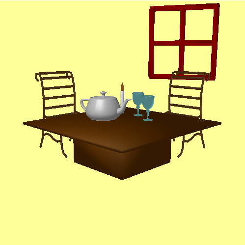
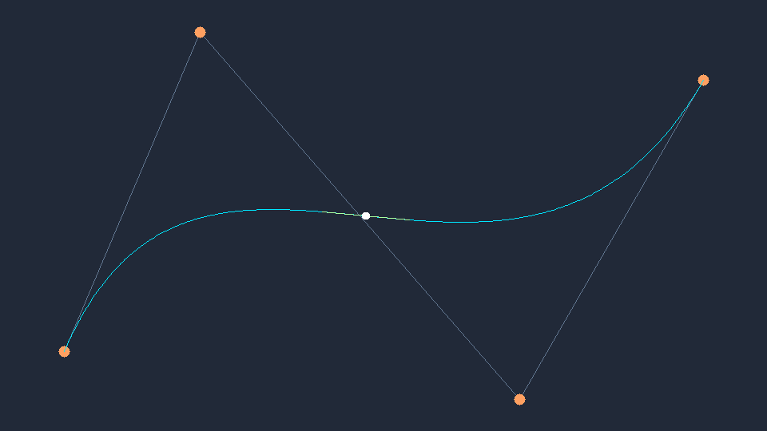
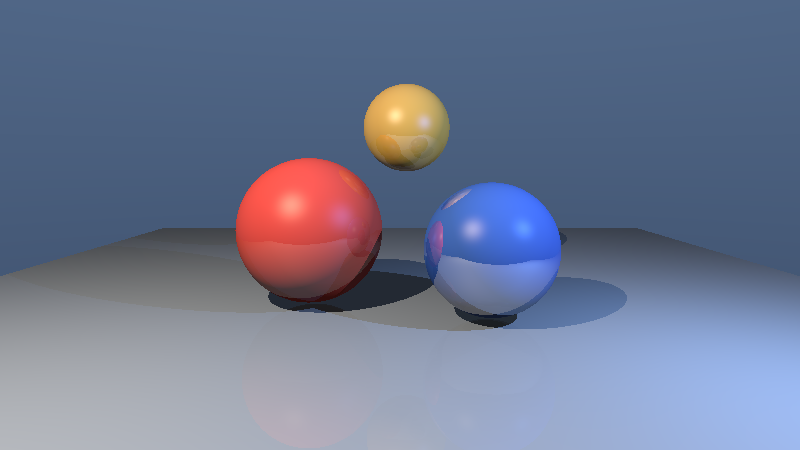
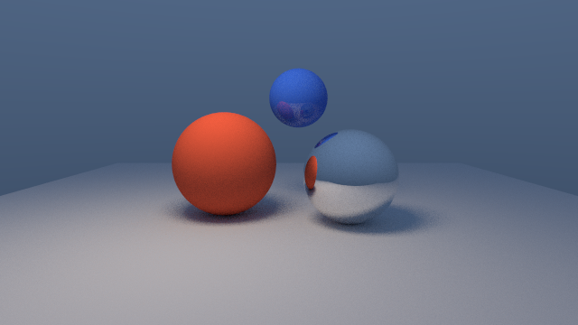
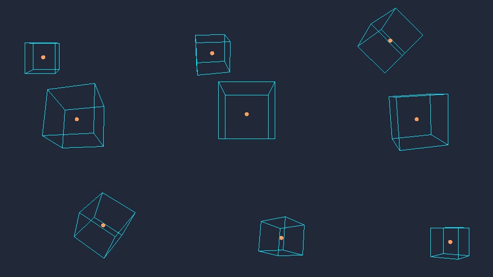
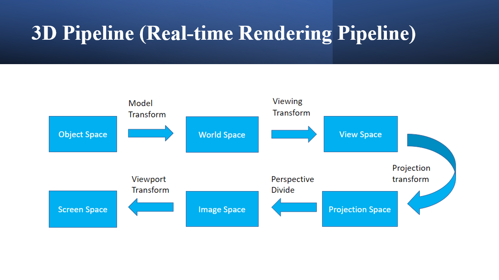

# CPU Rasterization & Shading Labs

[](https://github.com/jackson09255921/Computer_Graphics/actions/workflows/ci.yml)

A from-scratch computer graphics learning project written in C++ and visualized
with OpenGL/GLUT. OpenGL is used only to display points; rasterization,
transformations, clipping, visibility, and shading are implemented on the CPU.

> 以 C++ 從零實作光柵化與即時渲染管線。OpenGL/GLUT 僅負責顯示像素，核心演算法皆由 CPU 完成。



## Highlights

- Scan conversion and polygon filling
- Viewport transformation and 2D clipping
- OBJ mesh loading
- Model, view, projection, and viewport transformations
- Perspective division and 3D clipping
- Back-face culling and Z-buffer visibility
- Blinn–Phong lighting
- Flat, Gouraud, and Phong shading
- Arbitrary-degree Bézier curves via De Casteljau subdivision

## Bézier curves

The modern curve module supports evaluation, derivatives, splitting, and
sampling for arbitrary-degree Bézier curves. It is available in two forms:

```bash
# Headless CPU rendering to a PPM image
./build/Release/bezier_demo bezier_demo.ppm

# Interactive OpenGL presentation layer
./build/Release/bezier_interactive
```

Drag the orange control points to reshape the interactive curve. Press `r` to
reset the curve and `q` or <kbd>Esc</kbd> to quit. Both applications use the
same API-agnostic `BezierCurve` implementation.



## Ray tracer

The offline CPU renderer includes sphere and triangle intersections, a
perspective camera, Blinn–Phong direct lighting, recursive reflections, and a
median-split bounding volume hierarchy (BVH). Rectangular area lights use
multi-sampled visibility rays for soft shadows, while jittered primary rays
provide anti-aliasing.

```bash
./build/Release/raytracer_demo raytracer_demo.bmp
```

The deterministic 800×450 demo uses four samples per pixel and 24 shadow rays
per area-light sample.



### Path tracing

The separate Monte Carlo path tracer adds cosine-weighted hemisphere sampling,
indirect diffuse illumination, explicit area-light sampling, mirror bounces,
Russian roulette termination, and a metallic/roughness GGX BRDF with Schlick
Fresnel and Smith visibility. Dielectric materials add Snell refraction, exact
Fresnel sampling, total internal reflection, and GGX rough transmission.
Radiance RGBE environment maps retain HDR values and provide latitude-longitude
image-based lighting with bilinear filtering.
Area-light and BSDF importance sampling are
combined with the 1995 Veach–Guibas power heuristic for lower-variance direct
lighting. The optional second argument controls samples
per pixel (64 by default):

```bash
./build/Release/pathtracer_demo pathtracer_demo.bmp 64
```

The random seed is fixed, so identical settings produce reproducible images.
Raise the sample count for a cleaner result or lower it for faster previews.
Rendering is progressive and uses a deterministic multi-threaded tile scheduler;
changing the thread count or tile execution order does not change the pixels.

### CUDA path tracing

The optional WSL2/CUDA build includes a deterministic tiled GPU path tracer.
Its feature baseline renders diffuse, GGX-rough metallic, and dielectric glass
spheres plus triangle meshes through a CPU-built, flattened GPU BVH, with up
to six bounces and Russian roulette. Glass paths use Snell refraction, exact
dielectric Fresnel sampling, total internal reflection, and rough microfacet
normals. Rectangular area lights use next-event estimation, visibility rays,
solid-angle PDFs, and the 1995 power heuristic to combine light and
cosine-weighted diffuse sampling. A 16x16 device tile buffer keeps temporary pixel
storage bounded (about 3 KiB), leaving the RTX 4060 Laptop's 8 GiB budget for
larger scene and material data:

```bash
cmake -S . -B build-wsl -G Ninja -DBUILD_LEGACY_LABS=OFF -DBUILD_CUDA_DEMOS=ON
cmake --build build-wsl --target cuda_pathtracer
./build-wsl/cuda_pathtracer cuda_pathtracer.bmp 64
./build-wsl/cuda_pathtracer --self-test
./build-wsl/cuda_pathtracer --gltf model.gltf cuda_model.bmp 64
./build-wsl/cuda_pathtracer --hdr environment.hdr cuda_hdr.bmp 64
./build-wsl/cuda_pathtracer --gltf model.gltf cuda_model.bmp 64 environment.hdr
```

The `--gltf` path converts imported scene triangles and base-color,
metallic, and roughness factors into compact CUDA buffers and rebuilds the
flattened GPU BVH. Radiance RGBE environments retain linear HDR energy during
upload and use device-side latitude-longitude bilinear filtering. A CPU-built
`luminance * sin(theta)` PMF/CDF concentrates CUDA samples on bright texels;
solid-angle environment PDFs and the power heuristic combine environment NEE
with cosine-weighted BSDF paths. Metallic paths use the same GGX distribution
for half-vector sampling, Cook-Torrance BRDF evaluation, reflection PDFs, and
`BRDF * cos / PDF` throughput. Their area-light and HDR samples participate in
the same MIS framework. Rough dielectric transmission uses the Walter
transmission Jacobian, matched microfacet BTDF/PDF, and
`BTDF * abs(cos) / PDF` throughput.

The optional `restir_di` CUDA target contains the 2020 ReSTIR DI reservoir
foundation: weighted candidate streaming, temporal reuse, spatial reuse, and
final normalization with deterministic invariant tests. It is not yet wired
into the image renderer or backed by temporal G-buffers.

OptiX is also opt-in. `BUILD_OPTIX_DEMOS=ON` builds a real CUDA-driver/OptiX
device-context probe when the separately downloaded SDK is provided through
`OPTIX_ROOT`; it is independent of `BUILD_CUDA_DEMOS`. Native Windows is the
recommended OptiX runtime while the normal CUDA renderer remains in WSL2.
The OptiX branch now includes an indexed-mesh pipeline with triangle GAS,
raygen/miss/closest-hit programs, per-primitive colors, an SBT, RTX traversal,
PPM output, and optional input through the shared glTF loader. Geometric
normals drive Lambert direct lighting, with a second ray type providing
hardware-traversed hard shadows.

The dependency-free `LabX/assets` loader imports glTF 2.x triangle primitives
from external binary buffers, including indexed or non-indexed geometry, scene
node transforms, and metallic/roughness material factors:

```bash
./build/gltf_demo model.gltf
```

The current focused subset accepts `.gltf` JSON with one external buffer,
FLOAT `POSITION` accessors, triangle topology, and 8/16/32-bit unsigned indices.
Textures, animation channels, sparse accessors, Draco compression, and `.glb`
containers remain explicit future extensions.



## Keyframe animation

The animation module interpolates translation and scale linearly, rotation with
Quaternion SLERP, and timing with configurable cubic Bézier easing. The demo
exports 60 deterministic frames plus a contact sheet:

```bash
./build/Release/animation_demo animation_frames
```



## Labs

| Lab | Focus | Source | Example |
| --- | --- | --- | --- |
| 1 | Interactive drawing primitives | Incorporated into later labs; the standalone source was not preserved | [`image28.png`](images/image28.png) |
| 2 | Polygon filling, viewport transforms, and 2D clipping | [`2022CG_Lab2.cpp`](legacy/2022CG_Lab2/2022CG_Lab2.cpp) | [`image35.png`](images/image35.png) |
| 3 | Complete 3D transformation and rasterization pipeline | [`2022CG_Lab3.cpp`](legacy/2022CG_Lab3/2022CG_Lab3.cpp) | [`image37.png`](images/image37.png) |
| 4 | Z-buffering and Flat/Gouraud/Phong shading | [`2022CG_Lab4.cpp`](legacy/2022CG_Lab4/2022CG_Lab4.cpp) | [`image37.png`](images/image37.png) |

### Pipeline



The Lab 3 renderer transforms mesh vertices through object, world, view,
projection, and screen spaces. It then clips geometry, rejects back-facing
surfaces, and rasterizes the visible polygons.

### Lighting and shading


Lab 4 evaluates ambient, diffuse, and specular lighting and supports three
interpolation frequencies:

- **Flat:** one lighting result per triangle
- **Gouraud:** lighting per vertex, followed by color interpolation
- **Phong:** normal interpolation followed by per-pixel lighting

## Build

### Requirements

- A C++17 compiler
- CMake 3.18+
- OpenGL development libraries

If GLUT/freeglut is not installed, CMake downloads and builds a pinned freeglut
release automatically.

Ubuntu/Debian:

```bash
sudo apt install build-essential cmake freeglut3-dev
```

Configure and compile:

```bash
cmake -S . -B build
cmake --build build --config Release
```

## Run

The programs resolve `Data/` and `Mesh/` relative to their corresponding lab
directory. Run each executable with that directory as the working directory.

```bash
cd legacy/2022CG_Lab2
../../build/lab2 lab2D.in

cd ../2022CG_Lab3
../../build/lab3 Lab3B.in

cd ../2022CG_Lab4
../../build/lab4 lab4A.in phong
```

On multi-config generators such as Visual Studio, executables may be under
`build/Release/`. Lab 4 accepts `flat`, `gouraud`, or `phong` as its second
argument.

## Controls

After the window opens, press <kbd>Enter</kbd> to advance through commands from
the selected input file. Some inherited drawing controls are also available:

| Key | Action |
| --- | --- |
| `d` | Draw points/freehand strokes |
| `l` | Draw a line |
| `p` | Draw a polygon |
| `c` | Draw a circle |
| `u` | Undo |
| `s` | Change color |
| `e` | Clear |
| `q` | Quit |

## Repository layout

```text
.
├── legacy/            # preserved 2022 OpenGL coursework
├── LabX/              # categorized rendering experiments
├── src/               # reusable API-independent core library
├── tests/             # portable core tests
├── docs/              # architecture and technology timeline
├── images/            # diagrams and rendered results
└── CMakeLists.txt     # reproducible build configuration
```

## Architecture

The original labs are preserved as legacy OpenGL presentation targets. New
renderer features build on `cg_core`, which has no OpenGL or DirectX dependency
and writes to an owned CPU framebuffer. This keeps the rendering algorithms
portable while allowing different presentation backends later. See the
[architecture overview](docs/architecture.md) for the module boundaries.

The categorized experiments, detected RTX 4060 constraints, and staged GPU
roadmap are documented in [`LabX/README.md`](LabX/README.md).
The corresponding research milestones are listed in the
[`rendering technology timeline`](docs/timeline.md).

For GPU development, use the reproducible WSL2 environment in
[`environment.yml`](environment.yml). It supplies CUDA 13.1, CMake, and Ninja
without installing a Linux display driver inside WSL.

For a headless build of only the portable core and its tests:

```bash
cmake -S . -B build-core -DBUILD_LEGACY_LABS=OFF
cmake --build build-core
ctest --test-dir build-core --output-on-failure
```

## Current limitations

- The renderer is educational and intentionally CPU-bound.
- Source files are monolithic because each lab builds on the previous one.
- The standalone Lab 1 source is not present in the original archive.
- The remaining sample meshes came from the original coursework archive and
  still require a provenance/license review before this project can adopt an
  open-source license. Character and celebrity meshes with unclear rights were
  removed from the public source tree.

## Acknowledgements

This project was developed as a sequence of 2022 computer graphics coursework
labs. The conceptual study also drew from the
[GAMES101 computer graphics course](https://sites.cs.ucsb.edu/~lingqi/teaching/games101.html).
