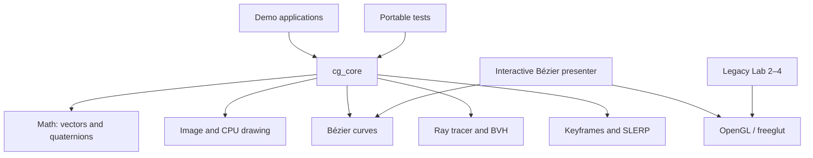

# Architecture

The repository separates graphics algorithms from presentation APIs. The
modern modules write to an owned CPU framebuffer and can be built without
OpenGL or a window system.

## Modules

| Module | Responsibility | Graphics API dependency |
| --- | --- | --- |
| `core/math` | Vectors, products, interpolation, quaternions, SLERP | None |
| `core/image` | Owned framebuffer and BMP/PPM output | None |
| `core/draw` | CPU line and disc rasterization | None |
| `curves` | Arbitrary-degree De Casteljau evaluation and subdivision | None |
| `raytracer` | Rays, primitives, BVH, lights, shadows, reflections | None |
| `animation` | Keyframes, transforms, cubic Bézier easing | None |
| `bezier_interactive` | Mouse input and presentation | OpenGL/freeglut |
| `2022CG_Lab*` | Preserved coursework implementations | OpenGL/freeglut |

`BUILD_LEGACY_LABS=OFF` produces a headless build suitable for Linux CI,
servers, and environments where no windowing system is available.
